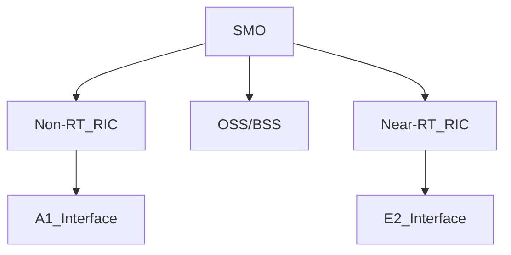

# Summary: SMO - Enabling Intelligent RAN Operations
- **Source:** [Ericsson White Paper](https://www.ericsson.com/en/reports-and-papers/white-papers/smo-enabling-intelligent-ran-operations)
- **Date:** 5 June 2025
## 1. Introduction to SMO
**Definition**: Service Management and Orchestration (SMO) is a framework for intelligent RAN operations
**Purpose**: Enables automation and optimization of multi-vendor Open RAN networks. Enhances customer experience and lowers costs.
**Standardization**: Part of O-RAN Alliance architecture specifications

## 2. Key Components of SMO
### 2.1. Functional Architecture
- **Non-Real-Time RIC**: For slow control loops (>1s)
- **Near-Real-Time RIC**: For faster control loops (<1s)
- **SMO Platform**: Provides:
  - Service management
  - Network orchestration
  - Automation
### 2.2. Interfaces
- **O1 Interface**: For management and orchestration
- **A1 Interface**: For policy management
- **Open APIs**: For third-party application integration

## 3. Core Capabilities
| Capability | Description | Benefit |
|------------|-------------|---------|
| **Automated Provisioning** | Zero touch deployment of network functions | Faster rollout |
| **Closed-loop Automation** | AI/ML-driven optimization | Improved QoS |
| **Energy Savings** | Intelligent sleep modes | Up to 15% energy reduction |
| **Anomaly Detection** | Predictive maintenance | Reduced downtime |

## 4. Use Cases
### 4.1. Traffic Steering
- Dynamically allocates resources based on demand
- Uses xApps in Near-RT RIC
### 4.2. Energy Optimization
- AI-powered cell sleep/wake strategies
- *Example: 10-15% energy savings in trials*
### 4.3. Capacity Optimization
- Predictive scaling based on traffic patterns
- Machine learning models for forecasting

## 5. Implementation Considerations
- **Challenges**:
  - Multi-vendor integration
  - Security of open interfaces
  - Performance assurance
- **Ericsson's Approach**:
  - Cloud-native implementation
  - Pre-integrated solutions

## Key Takeaways
1. SMO is essential for managing complexity in Open RAN
2. Enables intelligent automation through RIC integration
3. Delivers operational efficiencies (energy, capacity, maintenance)
4. Requires careful implementation for multi-vendor environments

## ℹ️ RAN-related Terminology
- Cloud RAN : Virtualized RAN to be cloud native in a future proof architecture. Key elements: microservices, CI/CD, containerization
- O-RAN     : Open Radio Access Network Alliance
- Open RAN  : RAN with open interoperable interfaces, virtualization, big data, and AI-enabled RAN.
- OpenRAN   : Iniatives driven by TIP's OpenRAN Project Group
- vRAN      : 5G software-defined, programmable, generating additional RAN architecture.

# Summary: Open RAN Service Management and Orchestration (SMO)
- **Source:** [Techplayon Article](https://www.techplayon.com/open-ran-service-management-and-orchestration-smo/)
- **Date:** 6 June 2025
## 1. Introduction to SMO
**Definition**: "Brain" of RAN Operations
**Purpose**: Service management, network orchestration, automation.
**Position in Architecture**: Sits above RAN Controllers (RICs), connects to OSS/BSS systems

## 2. SMO Architecture Components

### 2.1. Key Interfaces
| **Interface** | **Connects To** | **Purpose** |
|---------------|-----------------|-------------|
| **O1** | O-RAN Nodes | FCAPS management |
| **A1** | Non-RT RIC | Policy guidance |
| **Open APIs** | Third-party apps | Service innovation |

## ℹ️ 3. Critical SMO Functions
### 3.1. Service Orchestration
- Lifecycle management of network services
- *Example: Automation scaling of CU/DU resources*
### 3.2. RAN Optimization
- AI/ML Applications:
  - Traffic load balancing
  - Energy savings
  - Mobility optimization
### 3.3. Automation
- Closed-loop operations
- Intent-based management

## 4. Open RAN vs Traditional RAN
| **Aspect** | **Traditional RAN** | **Open RAN with SMO** |
|------------|---------------------|-----------------------|
| **Management** | Vendor-specific | Standardized |
| **Automation** | Manual | AI-driven |
| **Flexibility** | Low | High |
| **Innovation** | Slow | Rapid via apps |

## 5. Implementation Challenges
1. Multi-vendor Integration
   - Interoperability testing requirements
2. Security Considerations
   - Open interfaces increase attack surface
3. Performance Assurance
   - Maintaining SLAs with disaggregated RAN

## 6. Future Evolution
- **Edge Integration**: SMO coordinating with MEC
- **AI Advancements**: More sophisticated xApps
- **6G Readiness**: Preparing for next-gen networks

## Key Takeaways
1. SMO enables vendor-agnostic RAN managements
2. Provides framework for AI-driven optimization
3. Critical for realizing Open RAN benefits
4. Implementation requires new operational paradigms
